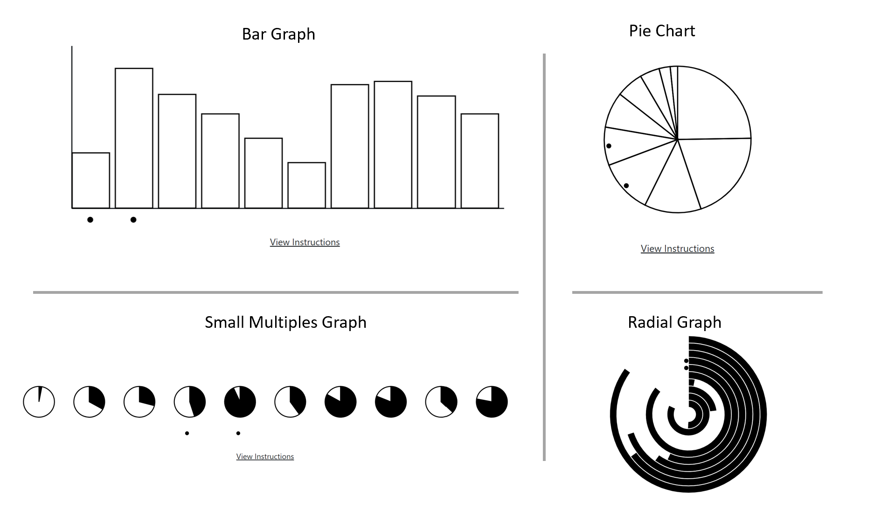
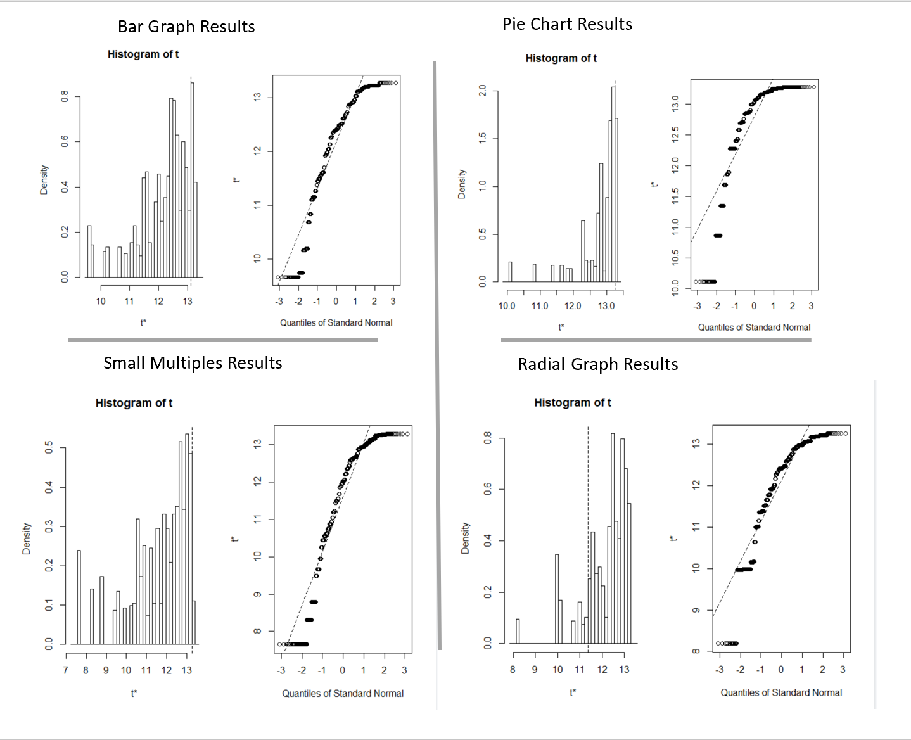
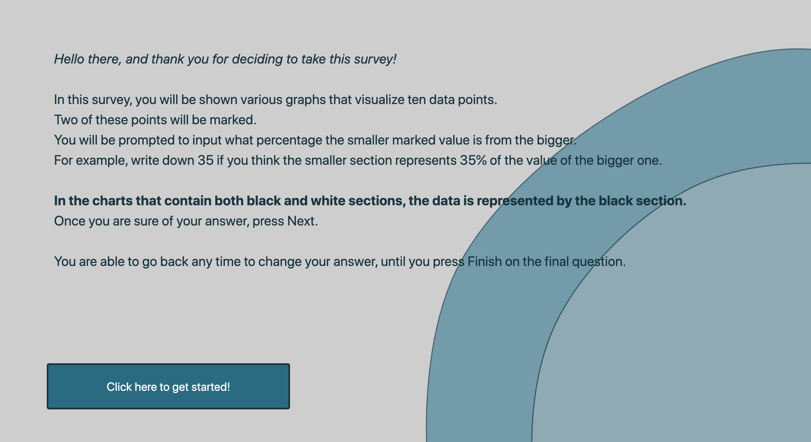
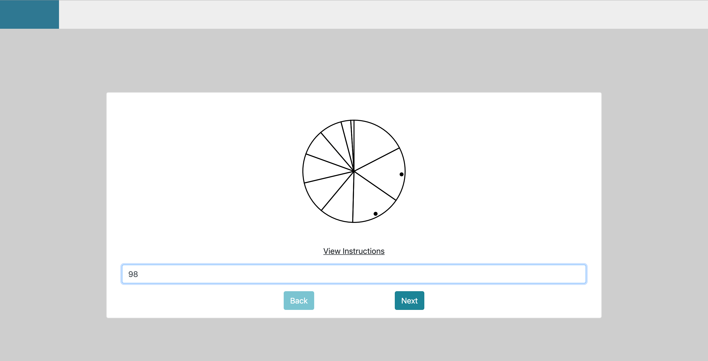
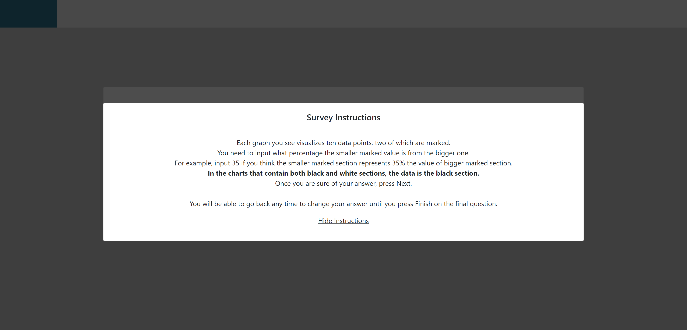
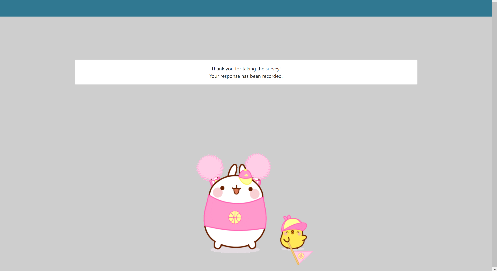

Assignment 3 - Replicating a Classic Experiment  
===

Link to app: [dataexperiment.herokuapp.com](dataexperiment.herokuapp.com)

Group Members: Petra Kumi, Philippe Lessard

Images of app at the bottom

## Description and Methodology

### Steps taken to implement survey

This assignment is a replication of an experiment done by Cleveland and McGill: <http://www.cs.ubc.ca/~tmm/courses/cpsc533c-04-spr/readings/cleveland.pdf>
To complete this assignment, we took the following steps:
- Create four different types of data visualizations
- Generate ten random points between 1 and 100 as data for each visualization
- Generate two random consecutive datapoints to mark in the visualization
    - We chose to compare consecutive datapoints throughout the experiment because we felt that comparing adjacent datapoints might lead to different results, and we wanted to compare our results to the ones from other studies that might not have compared exclusively adjacent datapoints.
- Prompt the subjects of our study to input what percentage is the smaller marked section of the bigger marked section
- Save the responses to a MongoDB database
- Aggregate the responses onto a CSV file
- Use Python to calculate a log base 2 error between the real and predicted value of each response, following the paper's example
- Use R to calculate the bootstrapped 95% confidence interval using normal distribution

### Types of charts generated

We generated four different types of charts/graphs: 
- Simple pie chart
- Simple bar chart
- Small multiples: ten small pie charts, each of which containing only one value of the dataset, denoted with black
- Radial graph: all datapoints are wrapped around each other in concentric rings. Each ring's data is shown by filling the ring with black starting from the top. 

Example graphs are shown below.
We had multiple reasons for deciding on these graphs: 
- We were interested to see if the bar charts are truly the easiest to accurately predict.
- We were interested to see if people truly have a hard time accurately predicting values in pie charts
- We wanted to use pie charts in a new way that is easier to evaluate. For this we decided to use small multiples. Our reasoning is that in the case of small
multiples, users only have to compare angles between charts, as the starting position is the same for all data points. We hoped that using aligned angles as a channel as opposed to unaligned angles would improve the accuracy. 
- We did not come across radial charts in the study, so we were curious to see how well users performed on this kind of data visualization, given that they have become really popular in modern UIs (Apple watch and Fitbit app being some examples)

## Results

From the study, we generated the following results:
- Total number of subjects: 20
- Number of predictions per subject: 12
- 95% confidence intervals (normal distribution, 1000 bootstrapped samples):
    - Bar Chart: (12.32, 15.75)
    - Pie Chart: (12.47, 14.90)
    - Small Multiples: (12.04, 17.59)
    - Radial Graph: (8.64, 12.52) 
- Best performing chart: radial graph
- Worst performing chart: small multiples
- Takeaways: We were expecting people to do really well on the bar charts and really poorly on the pie charts. Our hypothesis that the small multiples chart would perform better than the pie chart did not prove true. Moreover, we found it surprising that the radial graphs were the best performing ones, as we received a lot of feedback from people saying they were confusing. 

Below we show the graphs generated from bootstrapping to find the 95% confidence interval. The dotted line in the histogram shows the middle of the confidence interval.

## Achievements

### Technical Achievements

- Used Flask with a MongoDB server to store responses and Heroku for hosting
- Restricted input to numerical between 0 and 100
- Added a back button so users can move back and forth in the survey to change their answers without losing their progress
- Users can press Enter to move to the next visualization instead of the Next button
- Next button is disabled until user types in a value
- Users can read the help instructions at any time without interrupting their progress on the survey

### Design Achievements

- Used Bootstrap for a smoother-looking UI
- Added transitions to elements in the homepage for a smoother feel of the site
- Generated moving d3 polygons in the corner of the homepage to add to the design aspect of the site without distracting the user
- Added a progress bar to let users know what their progress on the survey is 
- Added an svg at the end of the survey because it's fun to have

## Some screenshots of our application:
### Home page

### The first experiment

### Help pop-up box

### The final page

